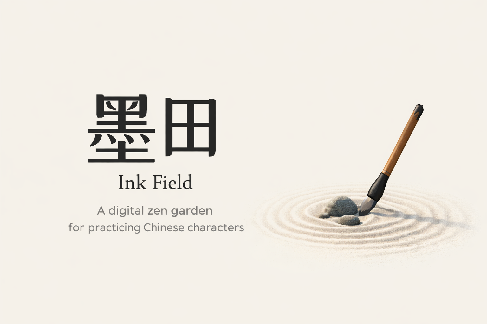

# 墨田 (Mòtián) · Ink Field



> a little digital zen garden for practicing Chinese characters, getting stroke order right, and finding poetic inspiration when your brain is empty.

[](./墨田.html)
[](#)
[](#)

## what is this?

**墨田** is a single-file, zero-dependency web app I built because I wanted a place to:

1. **generate 田字格** — Chinese character practice grids — with custom text, fonts, and sizes.
2. **look up stroke order** for any character (just click a grid box or type one in).
3. **draw random inspiration** from a curated collection of ~800 quotes spanning 论语, 道德经, Tang poetry, popular 成语, Zen koans, 鲁迅, and some modern stuff.

墨田 runs in your browser. No server deployment. No build steps. No package management. Just clone the repo and open `墨田.html` in a browser and start exploring.

follow the [quick start](#quick-start) steps to get started.

> **Note:** make sure you have JavaScript enabled in your browser. nothing works without it.

## features

| feature | what it does |
|---------|--------------|
| 📝 **田字格 -- Character Grid Generator** | paste any Chinese text, pick a font & size, get instant printable grids |
| ✍️ **笔顺 -- Stroke Order Viewer** | click any character in the grid to see how it's written, step by step |
| 🎲 **灵感 -- Inspiration Roulette** | random quotes by category; add them straight to your practice sheet |
| 🎨 **4 Themes** | light, dark, neon (still working on this one), and pastel (a lot like light but softer) |
| 🖨️ **Print Friendly** | hit "Print / Save PDF" and it just *works* (still working on getting this right) |
| 💾 **Persistent Settings** | your theme & font preferences stick around between sessions |

### included fonts

- 楷体 (KaiTi) — the classic. always fall back to this when in doubt (that's the app does too).
- 马山正楷 (Ma Shan Zheng) — 毛笔字，warm
- 霞鹜文楷 (LXGW WenKai) — modern and readable
- 演示秋鸿楷 (Slide Qiu Hong) — 毛笔字，elegant and flowing

> i'll add more fonts in v2!

## quick start

```bash
# clone or download the repo
git clone <repo-url>

# open it
cd 墨田
open 墨田.html        # macOS
# or
start 墨田.html       # Windows
# or
xdg-open 墨田.html    # Linux
```

That's it. 墨田 should be open in your browser at this point.

## project structure

```text
墨田/
├── 墨田.html           # the entire app lives here
├── stroke-data.js      # embedded stroke order data
├── inspiration-data.js # ~800 quotes from across the ages
├── fonts/              # bundled open-source Chinese fonts
│   ├── lxgwwenkai-regular.ttf
│   ├── ma-shan-zheng.ttf
│   └── slideqiuhong-regular.ttf
└── README.md           # you are here 👋
```

## why call it "墨田"?

the name occurred to me randomly at 3:00 AM.

**墨** (mò) = ink  
**田** (tián) = field (also the "田" in 田字格)

put them together and you get an "ink field": a little plot of land where characters grow. 
also it sounds nice.
also that's the EN translation Kimi recommended and I thought it was cute lol

## credits & license

- stroke order data derived from the [MakeMeAHanzi](https://github.com/skishore/makemeahanzi) project.
- fonts are open-source and bundled under their respective licenses.
- the quote collection is a personal curation built over time — feel free to borrow, remix, or add your own favorites in `inspiration-data.js`.

This project is shared as-is, with love, for anyone else who finds joy in writing or even just looking at Chinese characters.

---

*made over a weekend with curiosity, 黑利群, and 乌龙茶.* 🍵
